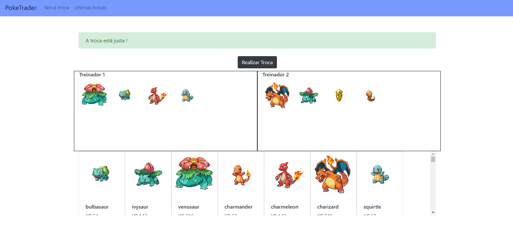
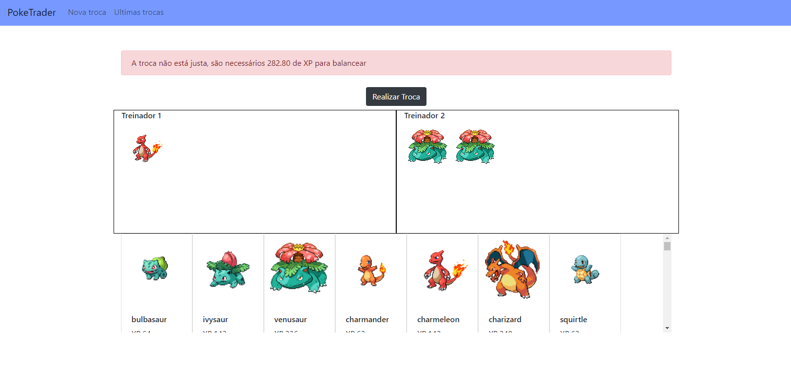
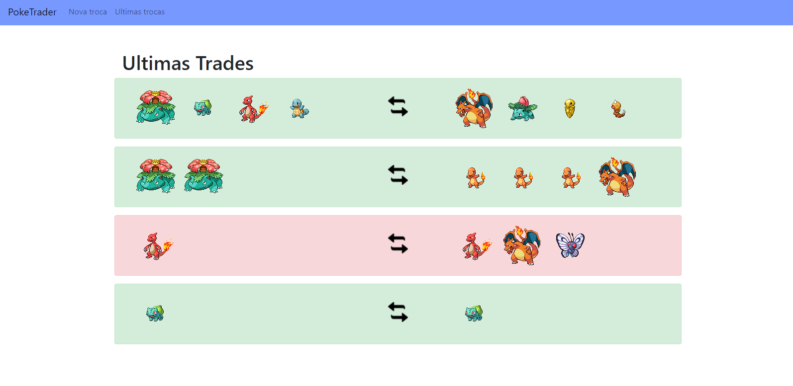

# Poke Trader

An application to help you decide if a pokemon trade is fair or not. This decision takes into account the sum of the base experience of each side of the trade. The maximum acceptable difference being 10% of the hightest of the two values.

The information regarding the base experience for each pokemon is provided by the [PokeAPI](https://pokeapi.co/docs/v2)

# How to use

The live version of the app can be accessed at https://bxpoketrader.herokuapp.com/

From there, you can see the most recent trades made and you can analyse your own trade by going to "Nova troca".
You just have to add the pokemons to both of the trade sides and a message will be displayed to tell you if the trade is fair or not, and how much xp is necessary to balance it if it's not.
Also, in the "Ultimas trocas" page, the fair trades made are the green ones. The red ones are trades that the users decided to make knowing they were unfair.

### Local build
If you decide to run the application locally, you can do so by using Docker. You just have to go to the root directory of the project and execute the following command:

```
docker-compose up 
```

Also, be sure to create a .env from our env.example.
From there you will be able to see the app running by accessing ```http://localhost:3000``` in your browsers.


### API Endpoints
You can also see some of the registered information through these api endpoints
* GET ```api/v1/pokemons```: lists all registered pokemons. You can also specify a limit and an offset to paginate the results
* GET ```api/v1/pokemons/<name>```: shows info of a desired pokemon, specified by name
* GET ```api/v1/trades```: shows all the trades registered
* POST ```api/v1/trades```: register a new trade. The expected JSON parameters are:
```
trade:{
    pokemons_group_one:Array<String> 
    pokemons_group_one:Array<String>
    is_fair:Boolean 
}
```
The Pokemon groups being arrays with the names of the pokemons being traded, and the boolean to indicate wether the trade is fair or not.

### Others
Some other useful commands to be run locally:
* ```rake db:seed```: fill the database  
* ```rspec```: run backend tests 
* ```yarn test```: run frontend tests

# Screenshots


